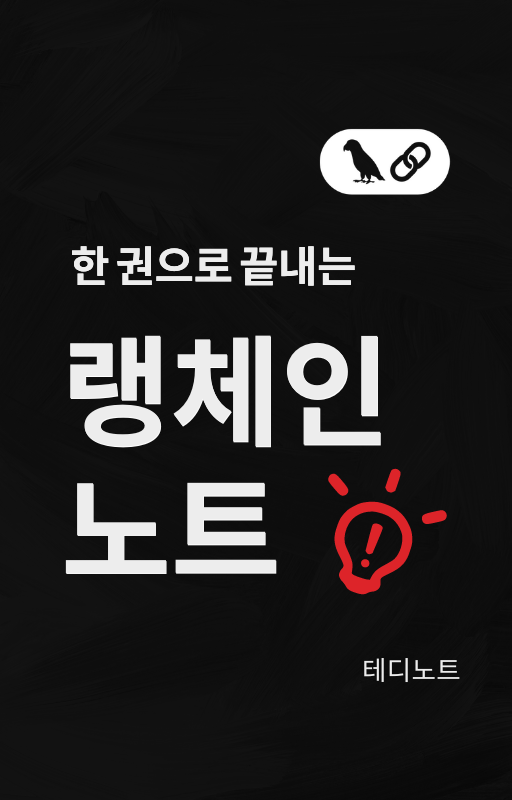

# 📘 LangChain 한국어 튜토리얼


🌟 **LangChain 공식 Document, Cookbook, 그 밖의 실용 예제**를 바탕으로 작성한 한국어 튜토리얼입니다. 

본 튜토리얼을 통해 LangChain을 더 쉽고 효과적으로 사용하는 방법을 배울 수 있습니다.


## 📔 위키독스 전자책(무료)




위키독스에 **무료** 전자책을 등록하였습니다✌️

위키독스 페이지에서 **책 "추천"** 버튼 한 번씩만 눌러 주시면 제작에 큰 힘이 됩니다. 미리 감사 드립니다🫶

틈나는대로 열심히 업데이트 하고 있습니다. 앞으로도 신규 기능이 추가 될 때마다 빠르게 x100 **업데이트** 예정입니다.

- [랭체인LangChain 노트 by 테디노트](https://wikidocs.net/book/14314) 구경하러 가기

## 🍿 유튜브
- [🤗 huggingface 에 공개된 오픈모델을 💻 로컬PC 에서 빠르게 실행🔥 해보고 테스트 하는 방법 + 모델 서빙🚀 + 업무자동화🤖 에 적용하는 방법까지!](https://youtu.be/bANQk--Maxs)
- [👀 코드 기반 답변하는 💻 GitHub 소스코드 기반 Q&A 챗봇🤖 제작기](https://youtu.be/yB8b-lW_5HY)
- [llama3 출시🔥 로컬에서 Llama3-8B 모델 돌려보기👀](https://youtu.be/12CuUQIPdM4)
- [🔥성능이 놀라워요🔥 무료로 한국어🇰🇷 파인튜닝 모델 받아서 나만의 로컬 LLM 호스팅 하기(#LangServe) + #RAG 까지!!](https://youtu.be/VkcaigvTrug)
- [무료로 한국어🇰🇷 파인튜닝 모델 받아서 나만의 로컬 LLM 호스팅 하기(LangServe) + RAG 까지!!](https://youtu.be/VkcaigvTrug)
- [Streamlit 으로 ChatGPT 클론 서비스 제작하는 방법](https://youtu.be/ZVmLe3odQvc)
- [대화내용을 기록하는 LLM Chain 생성 방법 + 도큐먼트 참조하는 tip!](https://youtu.be/VtS8yF2ItgI)
- [(Self Learning GPT) LangSmith 피드백으로 원하는 형식의 답변을 학습하는 GPT](https://youtu.be/8JEbrboSumg)
- [(LangServe 리뷰) 초간편 LLM 웹앱 제작 & 배포기능까지! 과연, Streamlit 대체할 수 있을까?](https://youtu.be/mdzMBF56HOM)
- [AI vs AI 의대 증원에 대한 모의 찬반토론 (AI 더빙본)](https://youtu.be/Z2j93efq1S0)
- [토론 AI 에이전트 - 의대 입학정원 증원에 대한 찬반토론을 AI 끼리 한다면?](https://youtu.be/NaU89YXQAoI)
- [긴 문서(long context) 에 대한 참신한 RAG 방법론: RAPTOR! 논문 리뷰와 코드를 준비했습니다](https://youtu.be/gcdkISrpMCA)
- [LangChain 밋업 발표 / R.A.G. 우리가 절대 쉽게결과물을 얻을 수 없는 이유](https://youtu.be/NfQrRQmDrcc)
- [노코딩으로 쇼핑몰 리뷰 분석 (크롤링 + Q&A 챗봇)](https://youtu.be/r5YyftofuII)
- [ChatGPT 의 GPTS 에 API 호출기능을 붙이면 어떻게 될까?](https://youtu.be/JBL4vhwUAnc)
- [LangChain Agent 를 활용하여 ChatGPT를 업무자동화 에 적용하는 방법🔥🔥](https://youtu.be/2q1XlbFVzf8)
- [Private GPT! 나만의 ChatGPT 만들기 (HuggingFace Open LLM 활용)](https://youtu.be/aECwQqBWfJM)
- [LangGraph 의 멀티 에이전트 콜라보레이션 찍먹하기](https://youtu.be/G8jrAA2bPnA)
- [마법같은 문법 LangChain Expression Language(LCEL)](https://youtu.be/0X4Ks_nJUt8)
- [이미지를 matplotlib 파이썬 코드로, 원하는 문장을 입력하면 파이썬 코드로 변환하는 방법](https://youtu.be/hY8Pquy3Hhg)
- [RAG 파이프라인 이해해보기 - 네이버 뉴스기사 기반 Q&A 챗봇 제작](https://youtu.be/1scMJH93v0M)
- [OpenAI 의 새로운 기능 Assistant API 완벽히 이해해보기](https://youtu.be/-Wne4a-8RlY)
- [OpenAI 의 새로운 기능 Assistant API 3가지 도구 활용법](https://youtu.be/BMW1NJkL7Ks)


## ✏️ 블로그 글 목록

### General

- [OpenAI API 모델 리스트 / 요금표](https://teddylee777.github.io/openai/openai-models/)

### OpenAI Python API

- [OpenAI Python API 키 발급방법, 요금체계](https://teddylee777.github.io/openai/openai-api-key/)
- [채팅(chat) 함수 사용하기(1)](https://teddylee777.github.io/openai/openai-api-tutorial-01/)
- [DALL·E를 사용하여 이미지 생성, 수정, 다양화하기(2)](https://teddylee777.github.io/openai/openai-api-tutorial-02/)
- [Whisper API를 사용하여 TTS, STT 구현하기(3)](https://teddylee777.github.io/openai/openai-api-tutorial-03/)

### LangChain

- [OpenAI GPT 모델(ChatOpenAI) 사용법](https://teddylee777.github.io/langchain/langchain-tutorial-01/)
- [허깅페이스(HuggingFace) 모델 사용법](https://teddylee777.github.io/langchain/langchain-tutorial-02/)
- [챗(chat) - ConversationChain, 템플릿 사용법](https://teddylee777.github.io/langchain/langchain-tutorial-03/)
- [정형데이터(CSV, Excel) - ChatGPT 기반 데이터분석](https://teddylee777.github.io/langchain/langchain-tutorial-04/)
- [웹사이트 크롤링 - 웹사이트 문서 요약](https://teddylee777.github.io/langchain/langchain-tutorial-05/)
- [웹사이트 정보 추출 - 스키마 활용법](https://teddylee777.github.io/langchain/langchain-tutorial-06/)
- [PDF 문서요약, Map-Reduce](https://teddylee777.github.io/langchain/langchain-tutorial-07/)
- [PDF 기반 질의응답(Question-Answering)](https://teddylee777.github.io/langchain/langchain-tutorial-08/)
- [문장을 파이썬 코드로, 이미지를 파이썬 코드로 변경하는 방법](https://teddylee777.github.io/langchain/langchain-code-generator/)
- [LangChain Expression Language(LCEL) 원리 이해와 파이프라인 구축 가이드](https://teddylee777.github.io/langchain/langchain-lcel/)
- [LLMs를 활용한 문서 요약 가이드: Stuff, Map-Reduce, Refine 방법 총정리](https://teddylee777.github.io/langchain/summarize-chain/)
- [자동화된 메타데이터 태깅으로 문서의 메타데이터(metadata) 생성 및 자동 라벨링](https://teddylee777.github.io/langchain/metadata-tagger/)
- [네이버 뉴스 기반 Q&A 애플리케이션 구축하기 - 기본편](https://teddylee777.github.io/langchain/rag-naver-news-qa/)
- [RAG 파헤치기: 문서 기반 QA 시스템 설계 방법 - 심화편](https://teddylee777.github.io/langchain/rag-tutorial/)
- [에이전트(Agent)와 도구(tools)를 활용한 지능형 검색 시스템 구축 가이드](https://teddylee777.github.io/langchain/langchain-agent/)

### LangGraph

- [Multi-Agent Collaboration(다중 협업 에이전트) 로 복잡한 테스크를 수행하는 LLM 어플리케이션 제작](https://teddylee777.github.io/langgraph/langgraph-multi-agent-collaboration/)
- [LangGraph Retrieval Agent를 활용한 동적 문서 검색 및 처리](https://teddylee777.github.io/langgraph/langgraph-agentic-rag/)

## 👥 LangChain 밋업 2024 Q1 발표자료

- [RAG - 우리가 절대 쉽게 원하는 결과물을 얻을 수 없는 이유 - 테디노트](https://aifactory.space/task/2719/discussion/830)
- [프름프트 흐름과 LLM 모델 평가 - 이재석님](https://aifactory.space/task/2719/discussion/831)
- [인공지능을 통한 게임 제작 파이프라인의 변화 - 김한얼님](https://aifactory.space/task/2719/discussion/834)
- [OpenAI SORA 살짝 맛보기 - 박정현님](https://aifactory.space/task/2719/discussion/839)
- [Semantic Kernel로 만드는 AI Copilot - 이종인님](https://aifactory.space/task/2719/discussion/835)
- [Streamlit 과 langchain으로 나만의 웹서비스 개발하기 - 최재혁님](https://aifactory.space/task/2719/discussion/832)
- [Llama2-koen을 만들기까지 - 최태균님](https://aifactory.space/task/2719/discussion/836)
- [올바른 한국어 언어 모델 평가를 위해: HAE-RAE Bench, KMMLU - 손규진님](https://aifactory.space/task/2719/discussion/833)
- [랭체인 네이버 기사 크롤링 - 우성우님](https://aifactory.space/task/2719/discussion/829)
- [Gemma와 LangChain을 이용한 SQL 체인만들기 - 김태영님](https://aifactory.space/task/2719/discussion/841)


## 📜 라이선스

본 프로젝트는 [Apache License 2.0](https://www.apache.org/licenses/LICENSE-2.0)에 따라 라이선스가 부여됩니다.

### 🚫 라이선스 고지 

🔒 본 내용의 저작권은 2024년 [테디노트](https://teddylee777.github.io)에 있습니다. 모든 권리는 저작권자에게 있으며, teddylee777@gmail.com 으로 문의할 수 있습니다.

```
Copyright 2024 테디노트(teddylee777@gmail.com)

Licensed under the Apache License, Version 2.0 (the "License");
you may not use this file except in compliance with the License.
You may obtain a copy of the License at

    http://www.apache.org/licenses/LICENSE-2.0

Unless required by applicable law or agreed to in writing, software
distributed under the License is distributed on an "AS IS" BASIS,
WITHOUT WARRANTIES OR CONDITIONS OF ANY KIND, either express or implied.
See the License for the specific language governing permissions and
limitations under the License.
```

**인용 및 출처 표기**

- 본 저작물의 내용을 블로그, 유튜브 등 온라인 매체에 인용하여 게재하는 경우, 저작권법에 따라 반드시 **출처를 명시** 해야 합니다.

**상업적 사용에 대한 사전 협의**

- 본 저작물(Wikidocs 및 관련 실습 코드 포함)을 강의, 강연 등 **상업적 목적으로 활용하고자 하는 경우**, 저작권자와의 사전 서면 협의가 필수적으로 요구됩니다.

본 내용의 무단 전재 및 재배포를 금지합니다. 본 내용의 전체 혹은 일부를 인용할 경우, 출처를 명확히 밝혀주시기 바랍니다.
본 문서는 다른 문서의 내용을 참고하여 작성되었을 수 있습니다. 참고 자료는 본 문서 하단의 출처 목록에서 확인하실 수 있습니다.

## 📚 출처

- [langchain-ai](https://github.com/langchain-ai/langchain) 📖
- [OpenAI API Reference](https://platform.openai.com/docs/introduction) 🤖

## 🌐 추가 자료

- **유튜브 채널**: [LangChain 한국어 튜토리얼](https://www.youtube.com/channel/UCt2wAAXgm87ACiQnDHQEW6Q) 🎥
- **블로그**: [테디노트](https://teddylee777.github.io) 📝
- **Playground**: [LangChain LLM Playground](http://llm.teddynote.com) 🎮

## 🚀 시작하기

본 튜토리얼을 시작하기 전에, LangChain과 관련된 기본적인 지식을 갖추는 것이 좋습니다. 위의 출처 링크를 통해 기본적인 정보를 얻을 수 있습니다.

## Start History

[](https://star-history.com/#teddylee777/langchain-kr&Date)


## 💡 컨트리뷰션

본 튜토리얼에 기여하고자 하는 분들은 언제든지 풀 리퀘스트를 보내주시거나, 이슈를 등록하여 의견을 공유해 주시기 바랍니다. 모든 기여는 본 프로젝트의 발전에 큰 도움이 됩니다. 💖

<br/>
<p><a href="https://www.buymeacoffee.com/teddylee777"> </a></p>
